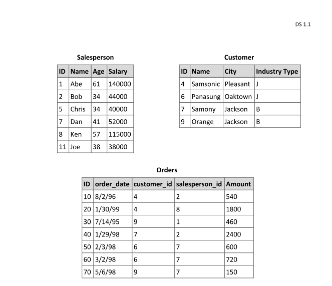

# Respostas Questionario


## 1). Provide an example scenario where overriding the equals() method is necessary in Java. Explain the key considerations when implementing this method, such as ensuring it aligns with the hashCode() method. Include code examples if possible.
###  
### R:

Digamos que você quer fazer um sistema de cadastro para festas, onde você precisa manter uma lista de chamada com as pessoas convidadas.

Cada pessoa tem um CPF e um nome. O CPF é o identificador único — ou seja, duas pessoas com o mesmo CPF não podem 
ser cadastradas mais de uma vez, mesmo que os nomes sejam diferentes.

Para evitar duplicatas, você usa um `Set`. Mas para isso funcionar corretamente, você precisa sobrescrever os métodos `equals()` e `hashCode()`.

- `equals()` diz quando dois objetos são iguais (ex: mesmo CPF).
- `hashCode()` precisa combinar com o `equals()`, senão `Set` ou `Map` podem funcionar errado (ex: salvar duplicado).

```java
import java.util.Objects;

public class Pessoa {
    private String cpf;
    private String nome;

    public Pessoa(String cpf, String nome) {
        this.cpf = cpf;
        this.nome = nome;
    }

    @Override
    public boolean equals(Object o) {
        if (this == o) return true;
        if (!(o instanceof Pessoa)) return false;
        Pessoa pessoa = (Pessoa) o;
        return cpf.equals(pessoa.cpf);
    }

    @Override
    public int hashCode() {
        return Objects.hash(cpf);
    }

    @Override
    public String toString() {
        return nome + " (CPF: " + cpf + ")";
    }
}
```

Utilização:

```java
import java.util.HashSet;
import java.util.Set;

public class Festa {
    public static void main(String[] args) {
        Set<Pessoa> convidados = new HashSet<>();

        convidados.add(new Pessoa("123", "Luan"));
        convidados.add(new Pessoa("456", "Alexandre"));
        convidados.add(new Pessoa("123", "Andre")); // Mesmo CPF que Luan - verificar duplicata

        System.out.println("Lista de convidados:");
        for (Pessoa p : convidados) {
            System.out.println(p);
        }

        System.out.println("Total de convidados: " + convidados.size()); // Resultado: 2
    }
}
``` 
Resultado:

```java
Lista de convidados:
Luan (CPF: 123)
Alexandre (CPF: 456)
Total de convidados: 2
```
#### O resultado é 2 convidados, porque o Set não aceita duplicados e a classe Pessoa define que duas pessoas com o mesmo CPF são iguais (equals e hashCode usam apenas o CPF). Por isso, Luan e Andre (ambos com CPF 123) são tratados como a mesma pessoa, e só um deles fica na lista.

#### Considerações:

- Um objeto nunca deve ser igual a null.
- Sempre que sobrescrever equals(), você também deve sobrescrever hashCode(). 
- Sempre utilizar instanceof (ou getClass()) para garantir que você está comparando o tipo certo de objeto.
- Repetidas chamadas a equals() devem retornar o mesmo valor enquanto os objetos não forem modificados.
- Se a.equals(b) for true, então b.equals(a) também deve ser true (ambos tende ser simetricos/harmonicos).


## 2). Explain how you would use a design pattern to decouple your code from a third-party library that might be replaced in the future. Describe the advantages and limitations of your chosen approach, and provide a small code snippet illustrating its application.
###  
### R: 

Neste exemplo vou utilizar Keycloak como sistema de autenticação, que futuramente você ira substituir por outro provedor (ex:Auth0, Firebase, etc).

A solução que eu adotaria seria utilizar o padrão Strategy com interface gerando um metodo genérico para authenticação, aonde a implementação do Keycloak ficaria
isolada, opto por utilizar isso pois o mesmo facilita a troca de bibliotecas para um diferente provedor de authenticação, mantem o codigo desacoplado da biblioteca e facilita possiveis testes/mocks, alguns pontos negativos seriam: A questão de precisar escrever um pouco a mais de codigo inicial e como estamos lidando com a abstração algumas funcionalidades muito especificas do provedor nesse caso o Keycloak podem ser dificeis de abstrair e tomar um pouco a mais de tempo.

Interface generiaca pra validar a authenticação 
```java
public interface AuthService {
    boolean isAuthenticated(String token);
    String getUserId(String token);
}
``` 

A implementação com o provedor/Keycloack
nesse caso eu crio um @Profile do keycloack que so vai funcionar se o mesmo estiver ativo nas properties/application.yml
ex: spring.profiles.active=keycloak

```java
import org.springframework.context.annotation.Profile;
import org.springframework.stereotype.Service;

@Service
@Profile("keycloak")
public class KeycloakAuthService implements AuthService {

    private final KeycloakClient keycloakClient;

    public KeycloakAuthService(KeycloakClient keycloakClient) {
        this.keycloakClient = keycloakClient;
    }

    @Override
    public boolean isAuthenticated(String token) {
        return keycloakClient.validateToken(token);
    }

    @Override
    public String getUserId(String token) {
        return keycloakClient.decodeToken(token).getSubject();
    }
}
```
agora para alterar a utilização do keycloack para auth0 so trocamos a implementação do AuthService sem alterar nenhum código da aplicação principal 
lembrando que o @Profile entra aqui para facilitar a troca entre as implementações

```java
import org.springframework.context.annotation.Profile;
import org.springframework.stereotype.Service;

@Service
@Profile("auth0")
public class Auth0AuthService implements AuthService {

    private final Auth0Client auth0Client;

    public Auth0AuthService(Auth0Client auth0Client) {
        this.auth0Client = auth0Client;
    }

    @Override
    public boolean isAuthenticated(String token) {
        return auth0Client.verify(token);
    }

    @Override
    public String getUserId(String token) {
        return auth0Client.extractUserId(token);
    }
}
```


## 3). Describe your experience with Angular, including its core features and use cases. Provide an example of a practical application where you used Angular and include a code snippet demonstrating a key feature, such as component communication, data binding, or service integration.
###
### R:

Tenho experiência com Angular principalmente no desenvolvimento de dashboards e aplicativos móveis com Ionic. Trabalhei com criação de CRUD, além da integração com APIs usando requisições HTTP feitas com Axios/HttpClient.

Alguns dos recursos principais do Angular que utilizei:

- Arquitetura baseada em componentes
- Data binding
- Injeção de dependência e uso de serviços
- Roteamento entre páginas
- Formulários reativos e baseados em template

Um exemplo prático foi um aplicativo mobile em IONIC utilizando angular a qual mostrava o composto mercadologico(Preço, Praça, Produto e Promoção) em diferentes abas onde os usuários podiam visualizar e editar cadastros de Produtos e Promoções. Para isso, criei um componente responsável por realizar chamadas HTTP para uma API REST, utilizando o serviço HttpClient do Angular. Os dados recebidos eram exibidos dinamicamente na interface através de data binding, permitindo também ações como edição e atualização dos cadastros diretamente na tela atravez de um modal, Dentro do modal os campos do formulário eram preenchidos com os dados atuais do item selecionado. Após a edição, o componente enviava a atualização para a API utilizando uma chamada PATCH na API, e em seguida atualizava a lista exibida sem precisar recarregar a tela.

#### Exemplo de integração de serviço utilizando Data Binding e Observable para assincronia:


```typescript
// produto.service.ts - Serviço responsável por consumir a API
import { Injectable } from '@angular/core';
import { HttpClient } from '@angular/common/http';
import { Observable } from 'rxjs';

@Injectable({
  providedIn: 'root'
})
export class ProdutoService {
  private apiUrl = 'https://api.exemplo.com/produtos';

  constructor(private http: HttpClient) {}

  //utilização de Observable para esperar a resposta da API sem ocorrer o travamento da aplicação - assincrono
  getProdutos(): Observable<any[]> {
    return this.http.get<any[]>(this.apiUrl);
  }

  atualizarProduto(id: string, dadosAtualizados: any): Observable<any> {
    return this.http.patch(`${this.apiUrl}/${id}`, dadosAtualizados);
  }
}
```

```typescript
// produto.component.ts - Componente que consome o serviço e renderiza os dados
import { Component, OnInit } from '@angular/core';
import { ProdutoService } from './produto.service';

@Component({
  selector: 'app-produto',
  templateUrl: './produto.component.html'
})
export class ProdutoComponent implements OnInit {
  produtos: any[] = [];

  constructor(private produtoService: ProdutoService) {}

  //executa assim que o componente e inicializado em tela
  ngOnInit() {
    this.carregarProdutos();
  }

  carregarProdutos() {
    this.produtoService.getProdutos().subscribe(dados => {
      this.produtos = dados;
    });
  }

  editarProduto(produto: any) {
    // Exibe modal com os dados preenchidos
    // Após edição, chama atualizarProduto()
  }

  atualizarProduto(produtoAtualizado: any) {
    this.produtoService.atualizarProduto(produtoAtualizado.id, produtoAtualizado)
      .subscribe(() => {
        this.carregarProdutos(); // Atualiza a lista sem recarregar a página
      });
  }
}

```

Exibição de produtos com  *ngFor percorrendo a lista de Produtos e exibindo os dados deles com {{ }}
```html
<!-- produto.component.html - Exibição com data binding -->
<div *ngFor="let produto of produtos">
  <h3>{{ produto.nome }}</h3>
  <p>Preço: {{ produto.preco }}</p>
  <button (click)="editarProduto(produto)">Editar</button>
</div>

```

## 4). Discuss the techniques you use to prevent SQL injection attacks in web applications.
#### - Provide examples of code showing secure implementations, such as using parameterized queries or ORMs. Mention any additional measures you take to secure the database layer.

### R:

- Nunca realizo a conecção ao banco de dados como um usuário adimnistrador, Sempre utilziar um usuário com acesso limitado e controlado.
- Realizo validação e tratamento/saneamento dos dados de entrada(seja com verificação de formato de dados utilizando regex, lenght, etc), utilização de libs como javax.validation (@Email, @Size, etc).
- Utilizo sempre parametros tratados nas queries, nunca concatenando diretamente o valor nas consultas(ex: utilização do JDBC em um preparedStatement)
- Uso de ORMs (Hibernate, JPA, Sequelize, etc), a utilização de ORMs e segura pois por padrão os mesmos geram queries internas seguras.
- Utilização de criptografia em dados sensiveis como senhas utilizando bcrypt
- Utilização de WAF, RDS firewalls para banco de dados
- E claro realizar a manutenção do SGDB atualizado com possiveis correções de bugs/vulnerabilidades

### Exemplos:

O JPA gera a query segura com os parâmetros tratados.
```java
public interface UsuarioRepository extends JpaRepository<Usuario, Long> {
    List<Usuario> findByNomeContainingAndStatus(String nome, Status status);
}
```
utilizando PreparedStatement com JDBC puro.
```java
public Usuario buscarPorEmail(Connection conn, String email) throws SQLException {
    String sql = "SELECT * FROM usuarios WHERE email = ?";
    try (PreparedStatement stmt = conn.prepareStatement(sql)) {
        stmt.setString(1, email); // Evita SQL Injection
        ResultSet rs = stmt.executeQuery();

        if (rs.next()) {
            return new Usuario(rs.getInt("id"), rs.getString("email"));
        }
    }
    return null;
}
```
Utilização de setParameter com Hybernate HQL evitando a concatenação direta
```java
public Usuario buscarPorEmail(Session session, String email) {
    String hql = "FROM Usuario u WHERE u.email = :email";
    return session.createQuery(hql, Usuario.class)
                  .setParameter("email", email)
                  .uniqueResult();
}
```
Sanitização/tratamento de campo email usando Regex
```java
public boolean isEmailValido(String email) {
    String regex = "^[\\w-.]+@[\\w-]+\\.[a-zA-Z]{2,}$";
    return email != null && email.matches(regex);
}
```


## 5). Describe the steps you would take to diagnose and improve the performance of a batch process that interacts with a database and an FTP server. Explain how you would identify bottlenecks, optimize database queries, improve logic execution, and enhance file transfer efficiency. Provide examples of tools or techniques you would use during the analysis.
### R:

Antes de tudo eu gostaria de entender completamente o funcionamento do fluxo e de como a arquitetura esta funcionando, desde a concecção com o banco de dados, consulta, processamento e geração de arquivos para envio ao servidor FTP

- Apos isso: criaria logs detalhados com timestamp e verificaria consultas lentas, tenho uma ferramenta que utilizo muito para escrever meus SQL que se chama dbeaver, nele eu consigo basicamente filtrar queries que estao com processamento mais lento(algo muito parecido com o SQL Profiler), realizaria monitoramento de transferencia FTP com iftop, nload, alem dos logs do servidor, alem dos logs do Garbage Collection(verificar possiveis "vazamentos de memoria"), uma boa pedida caso não encontre nada tambem e utilizar o VisualVM e fazer verificações de consumo de CPU, uso de threads e possiveis gargalos na performance.

- Tentaria melhorar a otimização das queries com os padrões de index adequados, utilizando joins ao inves de multiplas queries em loop.

- Buscaria otimizar o código eliminando repetições, redundâncias e loops desnecessários. Para melhorar o uso de memória, adotaria o uso de streaming, processando os arquivos em pequenos blocos à medida que são lidos, evitando a carga completa na memória. Além disso, realizaria compactação dos arquivos (como ZIP ou GZIP) antes da transferência, reduzindo o tamanho dos arquivos e otimizando o uso de banda e tempo de envio.

- Como medidas para manutenção sugiro realizar algum monitoramento continuo com alguma ferramenta Prometheus + Grafana ou utilizando Datadog.




## 6). Given the tables above, write the SQL query that:
### a). Returns the names of all Salesperson that don’t have any order with Samsonic.
### R:

```sql
SELECT s.Name
FROM Salesperson s
WHERE s.ID NOT IN (
    SELECT o.salesperson_id
    FROM Orders o
    JOIN Customer c ON o.customer_id = c.ID
    WHERE c.Name = 'Samsonic'
);
```


### b). Updates the names of Salesperson that have 2 or more orders. It’s necessary to add an ‘*’ in the end of the name.
### R:

```sql
UPDATE Salesperson
SET Name = CONCAT(Name, '*')
WHERE ID IN (
    SELECT salesperson_id
    FROM Orders
    GROUP BY salesperson_id
    HAVING COUNT(*) >= 2
);
```


### c). Deletes all Salesperson that placed orders to the city of Jackson.
### R:
```sql
DELETE FROM Salesperson
WHERE ID IN (
    SELECT DISTINCT o.salesperson_id
    FROM Orders o
    JOIN Customer c ON o.customer_id = c.ID
    WHERE c.City = 'Jackson'
);
```


### d). The total sales amount for each Salesperson. If the salesperson hasn’t sold anything, show zero.
### R:
```sql
SELECT s.Name, COALESCE(SUM(o.Amount), 0) AS Total_Sales
FROM Salesperson s
LEFT JOIN Orders o ON s.ID = o.salesperson_id
GROUP BY s.ID, s.Name;
```


## 7). The customer has a system called XYZ and intends to start updates split into 3 phases. The requirements for the first phase are as follows:
### 1. Enable new data entries in the system, which will serve as input for the second phase.
### 2. Implement functionality to create, update, delete, and search plants. 
#### - Plants should have the following attributes:
- Code: Numeric only, mandatory, and unique.
- Description: Alphanumeric, up to 10 characters, optional.
#### - Only admin users can delete plants.
### 3. Ensure that the system prevents duplication of plant codes.

## Task: Based on the above information:
### 1). Write a use case or user story for this scenario, ensuring that it clearly addresses the requirements.
### R:
``` 
Como administrador do sistema XYZ,
Quero poder cadastrar, editar, excluir e buscar registros de plantas,
Para que eu possa manter atualizada a base de dados de plantas que será utilizada na próxima fase do sistema.

Criação de plantas:

1) O sistema deve permitir o cadastro de uma nova planta com os campos:
 - Código: obrigatório, numérico e único.
 - Descrição: opcional, alfanumérica, com até 10 caracteres.
 - Caso o código já exista, deve exibir uma mensagem de erro.

2) Edição de plantas:
 - O sistema deve permitir atualizar o código e/ou a descrição de uma planta existente, respeitando as mesmas validações da criação.

3) Exclusão de plantas:
 - Somente usuários com permissão de administrador devem conseguir excluir plantas do sistema.
 - O sistema deve validar a permissão antes de permitir a exclusão.

4) Busca de plantas:
 - O sistema deve permitir consultar uma ou mais plantas pelo código ou descrição.
```

### 2). Highlight any business rules or assumptions relevant to the solution.
### R:
``` 
1) Código da planta é obrigatório, numérico e único
 - Nenhuma planta pode ser criada ou atualizada com um código duplicado.
 - O campo "código" não pode conter letras ou caracteres especiais.

2) Descrição é opcional e limitada a 10 caracteres
 - Caso informada, deve conter apenas caracteres alfanuméricos.
 - O sistema deve validar o tamanho da string.

3) Apenas administradores podem excluir plantas
 - A exclusão de qualquer planta deve passar por verificação de perfil/role.
 - Usuários comuns podem apenas visualizar ou editar (se permitido).

4) Evitar dados duplicados no sistema
 - O sistema deve prevenir cadastros com códigos duplicados.
 - Caso isso ocorra, deve retornar uma mensagem clara ao usuário.

Assumptions:

1) O sistema XYZ terá, no futuro, outras fases que dependem diretamente dos dados de planta inseridos nessa fase.
2) A interface do sistema permitirá buscas e ações de forma intuitiva (por exemplo: filtros, botões de ação, formulários de edição, Paginação etc.).
3) O sistema validará as entradas tanto no frontend quanto no backend, garantindo segurança e consistência.
```

### 3). Describe any validations or security measures you would implement in the system.
### R:
```
1) Validação do Código da Planta
 - Obrigatório.
 - Deve conter apenas números ([0-9]+).
 - Deve ser único (validação no backend e constraint no banco de dados).

2) Validação da Descrição
 - Opcional.
 - Se fornecida, deve ter no máximo 10 caracteres.
 - Deve conter apenas letras e números.

3) Validação de Duplicidade
 - Antes de salvar, verificar se já existe uma planta com o mesmo código.
 - O banco deve ter uma constraint UNIQUE no campo codigo.

4) Autenticação e Autorização
 - Usuários devem estar autenticados.
 - Somente usuários com perfil admin podem excluir plantas.

5) Proteção contra SQL Injection
 - Utilizar ORM como JPA/Hibernate com parâmetros nomeados.
 - Nunca concatenar strings em consultas.

6) Logging e Auditoria
 - Registrar operações de criação, edição e exclusão.
 - Associar cada ação a um usuário autenticado.

7) Proteção contra CSRF/XSS
 - Ativar proteção contra CSRF.
 - Converter valores exibidos no frontend para evitar injeção de scripts(xss).
```


### 4). Suggest how you would test this functionality, including examples of edge cases.
### R:

```
1) Funcionalidades a serem testadas:
 - Criar planta
 - Atualizar planta
 - Excluir planta (somente admin)
 - Buscar planta

2) Casos de Teste Gerais
 a) Criar planta com código e descrição válidos
  - Descrição: Código numérico único e descrição opcional de até 10 caracteres
  - Retorno: Planta criada com sucesso
  	
 b) Atualizar planta existente
  - Descrição: Alterar descrição
  - Retorno: Atualização bem-sucedida

 c) Buscar planta pelo código	
  - Descrição: Buscar planta existente
  - Retorno: Planta encontrada

 d) Buscar planta inexistente
  - Descrição: Buscar código que não existe
  - Retorno: Retornar "não encontrado" ou lista vazia

  e) Excluir planta como admin
  - Descrição: Usuário com perfil admin exclui planta
  - Retorno: Exclusão bem-sucedida

  d) Excluir planta como usuário comum
  -	Descrição: Usuário não-admin tenta excluir
  - Retorno: Acesso negado

3) Edge Cases
  a) Código com letras
  - Descrição: Tentar criar planta com código "12A3"
  - Rejeitar: código deve ser numérico

  b) Código duplicado
  - Descrição: Tentar criar planta com código já usado
  - Rejeitar: duplicidade não permitida

  c) Descrição maior que 10 caracteres
  - Descrição: "Descrição muito longa"
  - Rejeitar: limite de 10 caracteres

  d) Código vazio ou nulo
  - Descrição: Criar planta sem informar código
  - Rejeitar: campo obrigatório

  e) Descrição vazia
  - Descrição: Criar planta sem descrição
  - Deve aceitar (campo opcional)

```